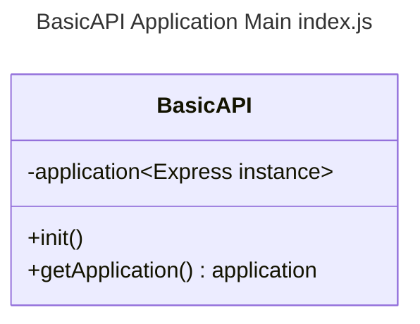
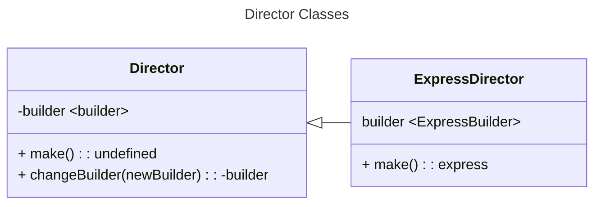

# BasicAPI [Application](../src/application/) Module Documentation
La aplicacion es una entidad que se construye en el momento del arranque de NodeJS y queda a la espera de eventos http en el event loop de NodeJS.

```Text
          The Event Loop
   ┌───────────────────────────┐
┌─>│           timers          │
│  └─────────────┬─────────────┘
│  ┌─────────────┴─────────────┐
│  │     pending callbacks     │
│  └─────────────┬─────────────┘
│  ┌─────────────┴─────────────┐
│  │       idle, prepare       │
│  └─────────────┬─────────────┘      ┌─────────────────┐
│  ┌─────────────┴─────────────┐      │     incoming:   │
│  │           poll            │<─────┤ The Application │
│  └─────────────┬─────────────┘      └─────────────────┘
│  ┌─────────────┴─────────────┐
│  │           check           │
│  └─────────────┬─────────────┘
│  ┌─────────────┴─────────────┐
└──┤      close callbacks      │
   └───────────────────────────┘

The cycle of one execution of the NodeJS.
```
Entonces definimos BasicAPI como esta entidad que en su interior construye una instancia de express.


---
## Usage
Para usar una aplicacion de BasicAPI, solo debe importar el modulo.

To Use a BasicAPI Application, only you need import a application module

```JS
const basicAPI = require('#Application');
console.debug(basicAPI);
```

```Bash
BasicAPI {
  application: <ref *1> [Function: app] {
    _events: [Object: null prototype] { mount: [Function: onmount] },
    _eventsCount: 1,
    _maxListeners: undefined,
   .
   .
   .
    },  
 features: [],  
 locals: {}  
}
```

Tenga encuenta que en el archivo [index.js](../src/application/index.js) puede encontrar el codigo.

La razon de porque solo se debe importar el modulo es por que cuando se hace la exportacion de dicho modulo este creara una nueva instancia, llamando al constructor de la clase.

```JS
class BasicAPI {
    constructor() {
        this.init();
    }
}
```

### Function Init | <None\> : <Undefined\>

La funcion init simplemente llama a el constructor de express y asigna su resultado a el atributo privado application.

```JS
init() {
    this.#application = builder();
}
```

### Function getApplication | <None\> : <application\>

es una funcion del tipo getter cuyo retorno es el atrubuto privado application.

```JS
getApplication() {
    return this.#application;
}
```

---

# Build Process

## Function build | <none\> : <express\>

La funcion Builder es una implementacion del patron de diseño Builder, donde implicitamente se hace uso de la logica para construir una instancia de Express.

```JS
module.exports = function build() {
    try {
        console.debug('[Build][Building a express Application]');
        const director = ExpressDirector;
        return director.make();
    } catch (error) {
        console.error(`[build][ExpressDirector][ # ERROR # ]`, error);
    }
}
```

## Class Director | <Builder\>

La clase director es una abstracion del patron builder, es una entidad cuyo proposito es la ejecucion de la logica de construccion de un builder o constructor.


## Class ExpressDirector | <ExpressBuilder\>

La clase ExpressDirector es la entidad que hace la implementacion de la logica de construccion del ExpressBuilder, lo hace en la definicion de la funcion make.

### Function make | <typeofProduct: String\> | <express\>

La funcion make hace uso de los metodos del builder segun el tipo de producto que se quiera construir.

### "Simple" typeofProduct
El tipo de construccion "simple", solo instanciara express y configurara la red si es el caso.

### "Default" typeofProduct
El tipo de construccion por defecto construira a express en funcion de las configuraciones en el archivo de ambiente (.env).

```JS
make(typeofProduct) {
    this.#builder.reset();
    if (typeofProduct === "simple") {
        console.debug('[ExpressDirector][make][Making a simple product]');
        this.#builder.stepBasic();
    } else {
        console.debug('[ExpressDirector][make][Making a complex product]');
        this.#builder.stepDisablePoweredby();
        this.#builder.stepSetFavicon();
        this.#builder.stepBuildinFeatures();
        this.#builder.stepSwagger();
        this.#builder.stepSetInspector();
        this.#builder.stepSetRouter();
        this.#builder.stepSetErrorHandler();
        this.#builder.stepSetLocals();
        this.#builder.stepSetNetwork();
    }
    return this.#builder.getProduct();
}
```
---

## Licencia
Este proyecto está licenciado bajo la licencia MIT.

## Autor
Cris-mur