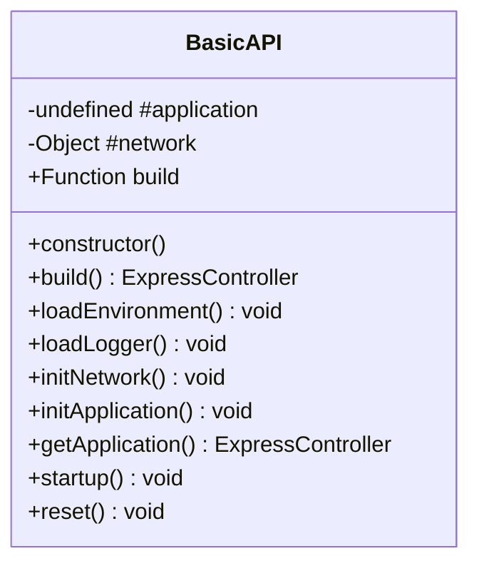
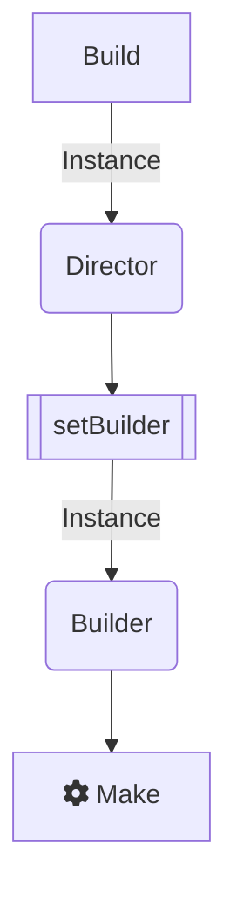
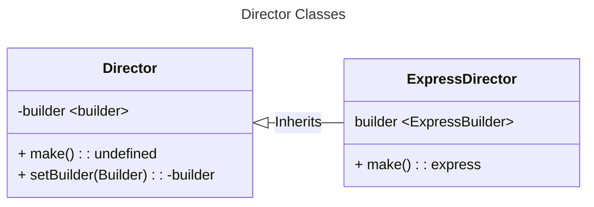

# Módulo [`application`](../src/application/)


---

## Descripción

Este módulo encapsula la implementación de un servidor Express y HTTP, proporcionando una instancia de la aplicación BasicAPI lista para usar.

Tenga en cuenta que este modulo funciona en modo singleton, una ves requerido por node.js este cargará una instancia única.

## Clases

### `BasicAPI`

Esta clase encapsula la implementación de Express y el servidor HTTP.

#### Propiedades

- `#application`: La instancia de la aplicación (puede ser `undefined` o `ExpressController`).
- `build`: Función para construir la aplicación.
- `#network`: Controlador de red de la aplicación.

#### Métodos

- `constructor()`: Inicializa la instancia de `BasicAPI` cargando el entorno, el logger e inicializando la aplicación.
  
- `loadEnvironment()`: Carga las variables de entorno desde el archivo `.env`.
  
- `loadLogger()`: Carga el logger personalizado.
  
- `initNetwork()`: Inicializa la interfaz de red.
  
- `initApplication()`: Construye una nueva instancia de aplicación y establece el listener de solicitudes.
  
- `getApplication()`: Retorna la instancia de la aplicación.

- `startup()`: Carga el entorno, el logger e inicializa la aplicación.
  
- `reset()`: Restablece la configuración de red volviendo a requerirla sin caché.

---

## Uso

Para utilizar esta clase, simplemente requiérela creando una nueva instancia:

```javascript
const BasicAPI = require('#Application');
```

Esta instancia gestionará automáticamente el entorno, la configuración del logger y la inicialización de la red, y finalmente quedando a la escucha de eventos de red TCP http request.

La razón de porque solo se debe importar el modulo es por que cuando se hace la exportación de dicho modulo este crea una nueva instancia, llamando al constructor de la clase.

---

# Build Process



## Función build: `ExpressController`

La función build es la implementación del patron de diseño Builder, donde implícitamente se hace uso de la lógica para construir una instancia de Express haciendo uso de las entidades Director y Builder.

```JS
module.exports = function build() {
    try {
        console.debug("[BUILD][Building Application]");
        const director = new ExpressDirector();
        director.setBuilder(new ExpressBuilder());
        return director.make();
    } catch (error) {
        console.error("[build][ExpressDirector][ # ERROR # ]", error);
        process.exit();
    }
}
```

## Class Director

La clase directora es una abstracción del patron builder, es una entidad cuyo propósito es la ejecución precisa de una lógica de construcción especifica que es expuesta por un Builder o constructor concreto.


## Class ExpressDirector

La clase ExpressDirector es la entidad que hace la implementación de la lógica de construcción de una instancia de ExpressBuilder.

### Function make 

```JS
make() {
    console.debug("[ExpressDirector][make][Making a complex product]");
    this.#builder.reset();
    this.#builder.stepDisablePoweredby();
    this.#builder.stepSetFavicon();
    this.#builder.stepBuildinFeatures();
    this.#builder.stepSwagger();
    this.#builder.stepSetInspector();
    this.#builder.stepSetRouter();
    this.#builder.stepSetErrorHandler();
    this.#builder.stepSetLocals();
    return this.#builder.getResult();
}
```
---
continue con la documentación de la entidad [Builder](./builder.md)
## Licencia
Este proyecto está licenciado bajo la licencia MIT.
## Autor
[@Cris-mur](https://github.com/cris-mur)
