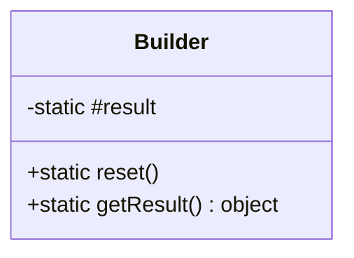
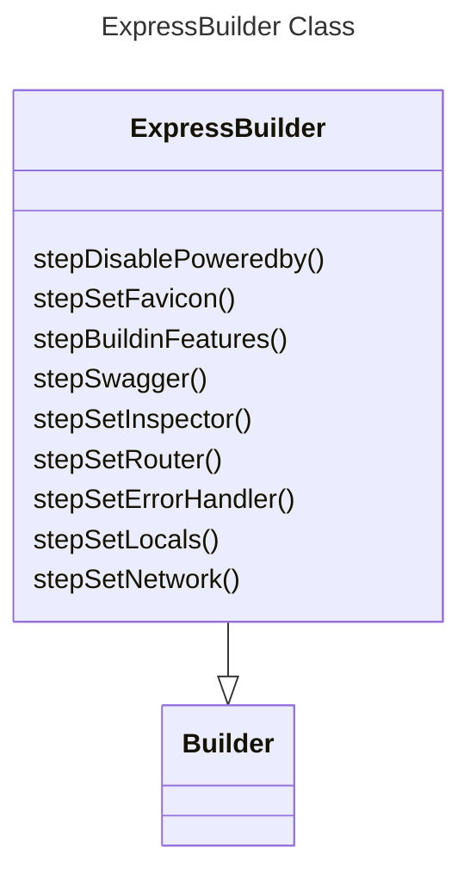
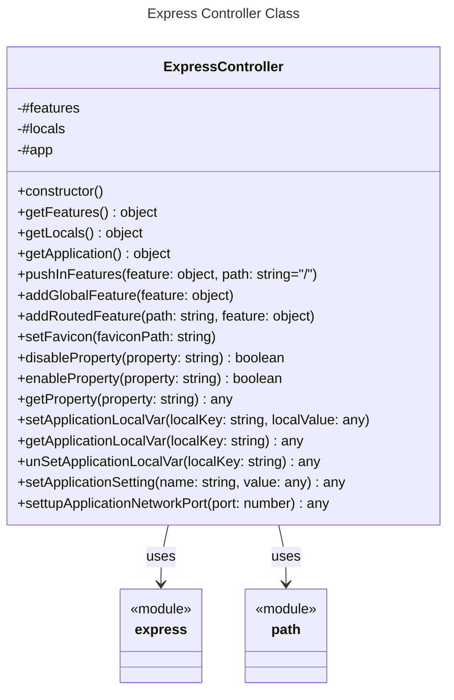

# Class Builder



## Descripción

El módulo `Builder` es una clase que proporciona métodos para construir y obtener resultados. Permite restablecer el resultado a un objeto vacío y obtener el resultado actual.

### Propiedades

- **#result**: Almacena el resultado.

### Métodos

#### reset

```javascript
reset()
```
Restablece el resultado a un objeto vacío.

#### getResult

```javascript
getResult()
```
Devuelve el resultado actual.

- **Retorno**: `object` - El resultado actual.

---



---

# ExpressController



## Descripción

El módulo `ExpressController` es un controlador para una instancia de aplicación de Express. Proporciona métodos para gestionar características globales y enrutadas, configurar variables locales y de entorno, y manipular configuraciones de la aplicación.

## Clase ExpressController

### Propiedades

- **#features**: Almacena las características de la aplicación.
- **#locals**: Almacena las variables locales de la aplicación.
- **#app**: Instancia de la aplicación Express.

### Métodos

#### Constructor

```javascript
constructor()
```
Inicializa una nueva instancia de la clase `ExpressController`.

#### getFeatures

```javascript
getFeatures()
```
Devuelve las características de la aplicación.

- **Retorno**: `object` - Las características de la aplicación.

#### getLocals

```javascript
getLocals()
```
Devuelve las variables locales de la aplicación.

- **Retorno**: `object` - Las variables locales de la aplicación.

#### getApplication

```javascript
getApplication()
```
Devuelve la instancia de la aplicación Express.

- **Retorno**: `object` - La instancia de la aplicación Express.

#### pushInFeatures

```javascript
pushInFeatures(feature, path = "/")
```
Añade una característica a la ruta especificada.

- **Parámetros**:
  - `feature` (`object`): La característica a añadir.
  - `path` (`string`, opcional): La ruta a la que añadir la característica. Por defecto es "/".

#### addGlobalFeature

```javascript
addGlobalFeature(feature)
```
Añade una característica global a la aplicación.

- **Parámetros**:
  - `feature` (`object`): La característica global a añadir.

#### addRoutedFeature

```javascript
addRoutedFeature(path, feature)
```
Añade una característica enrutada a la aplicación.

- **Parámetros**:
  - `path` (`string`): La ruta a la que añadir la característica.
  - `feature` (`object`): La característica a añadir.

#### setFavicon

```javascript
setFavicon(faviconPath)
```
Configura el favicon de la aplicación.

- **Parámetros**:
  - `faviconPath` (`string`): La ruta del favicon.

#### disableProperty

```javascript
disableProperty(property)
```
Desactiva una propiedad en la configuración de la aplicación.

- **Parámetros**:
  - `property` (`string`): La propiedad a desactivar.

- **Retorno**: `boolean` - El estado desactivado de la propiedad.

- **Errores**: Lanza un error si la propiedad no existe en la configuración de la aplicación.

#### enableProperty

```javascript
enableProperty(property)
```
Activa una propiedad en la configuración de la aplicación.

- **Parámetros**:
  - `property` (`string`): La propiedad a activar.

- **Retorno**: `boolean` - El estado activado de la propiedad.

- **Errores**: Lanza un error si la propiedad no existe en la configuración de la aplicación.

#### getProperty

```javascript
getProperty(property)
```
Obtiene una propiedad de la configuración de la aplicación.

- **Parámetros**:
  - `property` (`string`): La propiedad a obtener.

- **Retorno**: `any` - El valor de la propiedad.

#### setApplicationLocalVar

```javascript
setApplicationLocalVar(localKey, localValue)
```
Configura una variable local en la aplicación.

- **Parámetros**:
  - `localKey` (`string`): La clave de la variable local.
  - `localValue` (`any`): El valor de la variable local.

#### getApplicationLocalVar

```javascript
getApplicationLocalVar(localKey)
```
Obtiene una variable local de la aplicación.

- **Parámetros**:
  - `localKey` (`string`): La clave de la variable local.

- **Retorno**: `any` - El valor de la variable local.

#### unSetApplicationLocalVar

```javascript
unSetApplicationLocalVar(localKey)
```
Desconfigura una variable local en la aplicación.

- **Parámetros**:
  - `localKey` (`string`): La clave de la variable local.

- **Retorno**: `any` - El valor eliminado de la variable local.

#### setApplicationSetting

```javascript
setApplicationSetting(name, value)
```
Configura un ajuste en la aplicación.

- **Parámetros**:
  - `name` (`string`): El nombre del ajuste.
  - `value` (`any`): El valor del ajuste.

- **Retorno**: `any` - El valor configurado.

#### settupApplicationNetworkPort

```javascript
settupApplicationNetworkPort(port)
```
Configura el puerto de red para la aplicación.

- **Parámetros**:
  - `port` (`number`): El puerto a configurar.

- **Retorno**: `any` - El puerto configurado.

---

## Licencia
Este proyecto está licenciado bajo la licencia MIT.

## Autor
Cris-mur
