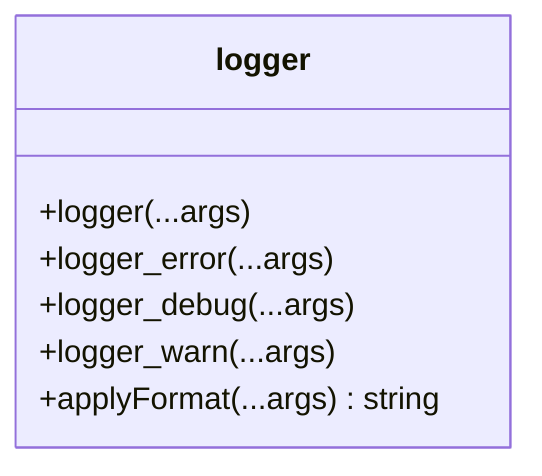
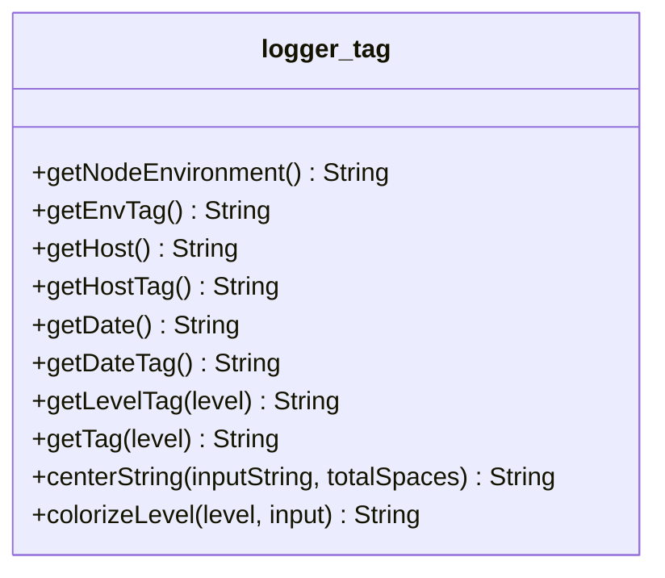

# [Logger](../src/utils/logger)



## Descripción

El módulo `logger` personaliza las funciones integradas de la consola para mejorar las características de registro. Sobrescribe las funciones de `console.log`, `console.error`, `console.debug` y `console.warn` con un formato personalizado y manejo de errores consciente del entorno.

## Métodos

### logger

```javascript
logger(...args)
```
Sobrescribe la función `console.log` con un formato personalizado.

- **Parámetros**: 
  - `...args` - Argumentos a registrar.

### logger_error

```javascript
logger_error(...args)
```
Sobrescribe la función `console.error`.

- **Parámetros**: 
  - `...args` - Argumentos a registrar como errores.

### logger_debug

```javascript
logger_debug(...args)
```
Sobrescribe la función `console.debug`.

- **Parámetros**: 
  - `...args` - Argumentos a registrar como mensajes de depuración.

### logger_warn

```javascript
logger_warn(...args)
```
Sobrescribe la función `console.warn`.

- **Parámetros**: 
  - `...args` - Argumentos a registrar como advertencias.

### applyFormat

```javascript
applyFormat(...args)
```
Maneja el formato de entrada usando la función `util.formatWithOptions`.

- **Parámetros**: 
  - `...args` - Entrada de la consola.
- **Retorno**: 
  - `string` - Cadena formateada con opciones.

---

# logger.tag



## Descripción

El módulo `logger.tag` personaliza las etiquetas en la consola para mejorar las características de registro. Proporciona funciones para generar etiquetas con formato, coloreadas y basadas en el entorno.

## Funciones

### getNodeEnvironment

```javascript
getNodeEnvironment()
```
Esta función devuelve el entorno de node configurado en `NODE_ENV`.

- **Retorno**: 
  - `String` - Entorno.

### getEnvTag

```javascript
getEnvTag()
```
Esta función devuelve una etiqueta de cadena del entorno.

- **Retorno**: 
  - `String` - `[ ${env} ]`.

### getHost

```javascript
getHost()
```
Obtiene el nombre de host de la máquina.

- **Retorno**: 
  - `String` - Nombre de host.

### getHostTag

```javascript
getHostTag()
```
Obtiene la etiqueta del nombre de host formateado.

- **Retorno**: 
  - `String` - Etiqueta del nombre de host formateado.

### getDate

```javascript
getDate()
```
Obtiene la fecha en formato ISO.

- **Retorno**: 
  - `String` - Fecha en formato ISO.

### getDateTag

```javascript
getDateTag()
```
Obtiene la etiqueta de la fecha formateada.

- **Retorno**: 
  - `String` - Etiqueta de la fecha formateada.

### getLevelTag

```javascript
getLevelTag(level)
```
Obtiene la etiqueta del nivel formateado.

- **Parámetros**: 
  - `level` - Nivel de registro.
- **Retorno**: 
  - `String` - Etiqueta del nivel formateado.

### getTag

```javascript
getTag(level)
```
Genera una etiqueta para imprimir en la consola.

- **Parámetros**: 
  - `level` - Nivel de registro.
- **Retorno**: 
  - `String` - Etiqueta generada.

### centerString

```javascript
centerString(inputString, totalSpaces)
```
Esta función centra una cadena en un espacio.

- **Parámetros**: 
  - `inputString` - La cadena a centrar.
  - `totalSpaces` - Los espacios totales para centrar.
- **Retorno**: 
  - `String` - Cadena centrada.

### colorizeLevel

```javascript
colorizeLevel(level, input)
```
Esta función agrega color a una cadena usando la etiqueta de nivel.

- **Parámetros**: 
  - `level` - Nivel de registro.
  - `input` - La cadena a colorear.
- **Retorno**: 
  - `String` - Cadena coloreada.

---

### Licencia
Este proyecto está licenciado bajo la licencia MIT.

### Autor
Cris-Mur
