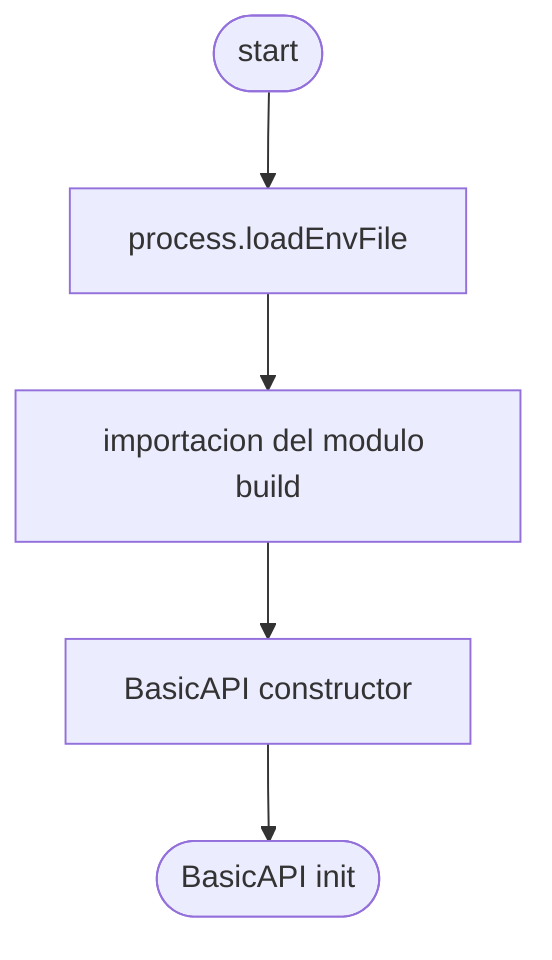

# BasicAPI Application Module

Application es el modulo principal de la aplicación, dentro de este modulo se define toda la lógica de implementación de express es decir la forma en la que se construye.

```JS
const basicAPI = require('#Application');
// OR
const basicAPI = require('/src/application');
```
Al momento de hacer la importacion de este modulo usted esta creando una nueva instancia de la applicacion, cargando el archivo de variables de entorno por defecto (.env), y ejecutando la logica de construccion de express.



vease el archivo [Index](./index.js)

---

## [Construccion](./build)

Express en si mismo contiene muchas caracteristicas que con el tiempo se han ido implementando en el core de express, haciendo que dependecias que se debian instalar independientemente en el pasado, ahora se encuentren aguardando a ser configuradas.

la forma en la que una aplicacion de express se configura generalmente es haciendolo secuencialmente, agregando primero los "Parsers" y despues los middlewares.

se ha desarrollado una funcion llamada [builder](./build/index.js), cuyo retorno es una instancia de express configurada.

```JS
const builder = require('./build');
```

---

### [Home](../../)
#### [└── src](../)