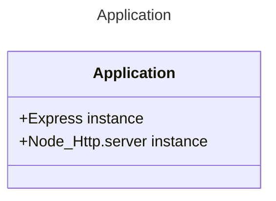

# [Application](./index.js)

The "Application" is a class module abstraction responsible for initialize Express and HTTP server. please review [index](./index.js)

---

## [builder](./builder)
The builder module, have the responsibility to build a express application, pushing all required middle-wares and policies into express.

## [network](./network/)

The Network module, takes a node:http library and exports specific features that are required.

## [utils](./utils/)

---

### [Home](../../)
#### [src](../)