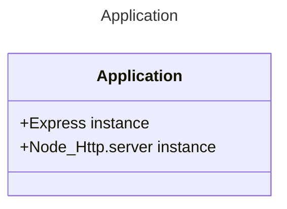

# [Application](./index.js)

"The Application" is an abstraction of a Nodejs Machine with Express and HTTP work together. In this case we needs handle creation and construction of the Application.



Express in itself has many features like Request parsers, in the past for example, you needed install body-parser to handle request and send JSON response, now Express support these features that in the past needed another libraries, and has become a very stable project.

First we need understand that NodeJS, is a Runtime Engine, that runs into "The Event Loop", this is the life cycle of one execution of the program.

```Text
          The Event Loop
   ┌───────────────────────────┐
┌─>│           timers          │
│  └─────────────┬─────────────┘
│  ┌─────────────┴─────────────┐
│  │     pending callbacks     │
│  └─────────────┬─────────────┘
│  ┌─────────────┴─────────────┐
│  │       idle, prepare       │
│  └─────────────┬─────────────┘      ┌─────────────────┐
│  ┌─────────────┴─────────────┐      │     incoming:   │
│  │           poll            │<─────┤ The Application │
│  └─────────────┬─────────────┘      └─────────────────┘
│  ┌─────────────┴─────────────┐
│  │           check           │
│  └─────────────┬─────────────┘
│  ┌─────────────┴─────────────┐
└──┤      close callbacks      │
   └───────────────────────────┘
```

Using a specific port that's receive a Internet Packages, Express listen all request that income into the machine, these request are parsed step by step into "Express Middleware queue", these queue are be conform by functions called "Middlewares" that takes three parameters, request, response, and next.

---
### Usage
To use this Application you need this code lines, the result are a Application that are built taking the settings into environment, all instances of the application are like others application but are a situation that has a easy solution.

```JS
const TheApplication = require('/src/application');
const basicApi = new TheApplication();

console.log(basicApi.express)
```

```Bash
ExpressApplication {  
 app: <ref *1> [Function: app] {  
   _events: [Object: null prototype] { mount: [Function: onmount] },  
   _eventsCount: 1,  
   _maxListeners: undefined,
   .
   .
   .
    },  
 features: [],  
 locals: {}  
}
```

---

## [builder](./builder)
The builder module, have the responsibility to build and export a Class that build Express Application, pushing all required middlewares and policies into express.

## [utils](./utils/)


---

### [Home](../../)
#### [src](../)