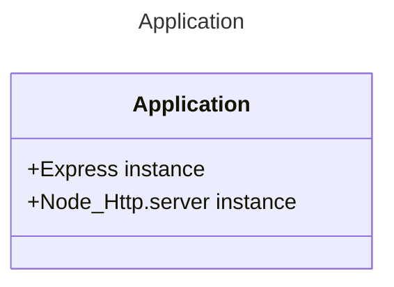

# [Application](./index.js)
The Application is a Entity that lives into Event Loop of Nodejs runtime.

First we needs understand NodeJS, and his Runtime Engine, that makes that "The Event Loop" exist.

```Text
          The Event Loop
   ┌───────────────────────────┐
┌─>│           timers          │
│  └─────────────┬─────────────┘
│  ┌─────────────┴─────────────┐
│  │     pending callbacks     │
│  └─────────────┬─────────────┘
│  ┌─────────────┴─────────────┐
│  │       idle, prepare       │
│  └─────────────┬─────────────┘      ┌─────────────────┐
│  ┌─────────────┴─────────────┐      │     incoming:   │
│  │           poll            │<─────┤ The Application │
│  └─────────────┬─────────────┘      └─────────────────┘
│  ┌─────────────┴─────────────┐
│  │           check           │
│  └─────────────┬─────────────┘
│  ┌─────────────┴─────────────┐
└──┤      close callbacks      │
   └───────────────────────────┘

The cycle of one execution of the program.
```


Then, "The Application" is an abstraction of a Nodejs Machine with Express and HTTP working together. 


---
### Usage
To use this Application you need this code lines, the result are a Application that are built taking the settings into environment, all instances of the application are like others application but are a situation that has a easy solution.

```JS
const TheApplication = require('/src/application');
const basicApi = new TheApplication();

console.log(basicApi.express)
```

```Bash
ExpressApplication {  
 app: <ref *1> [Function: app] {  
   _events: [Object: null prototype] { mount: [Function: onmount] },  
   _eventsCount: 1,  
   _maxListeners: undefined,
   .
   .
   .
    },  
 features: [],  
 locals: {}  
}
```

---

## [Builder](./builder)

Express by itself has many features build in like request parsers that in the past you needed install apart of express, for example, body-parser to handle request and send serialized response, now Express support these features that in the past needed another dependencies installations

Express to handle request, propose a concept called Middlewares, a step chain that one by one go resolving the request or falling in error handler.

Now, The builder folder, contains, the logic to create a new application, we implements a factory pattern to create a clean instances, additionally we use a builder pattern to apply all features that will be require.
## [utils](./utils/)


---

### [Home](../../)
#### [src](../)