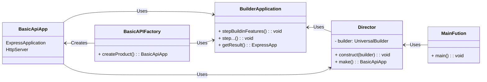
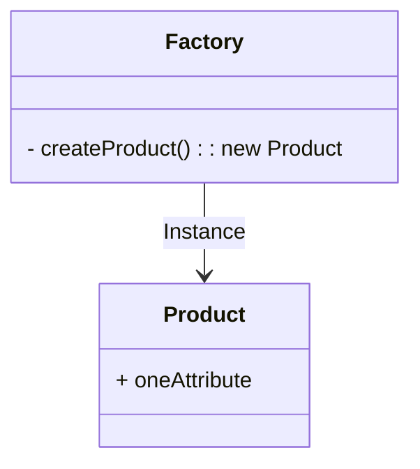
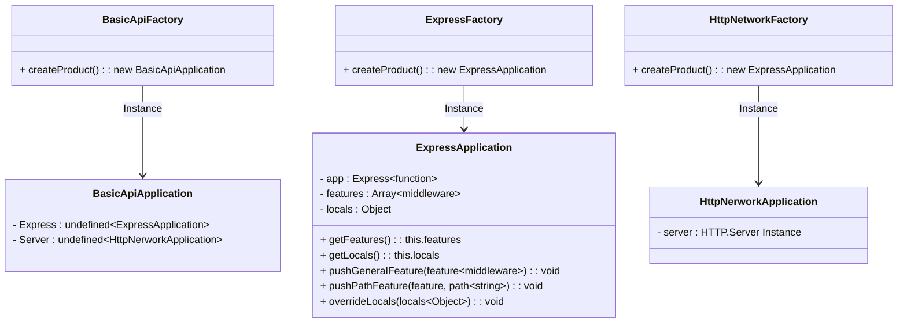
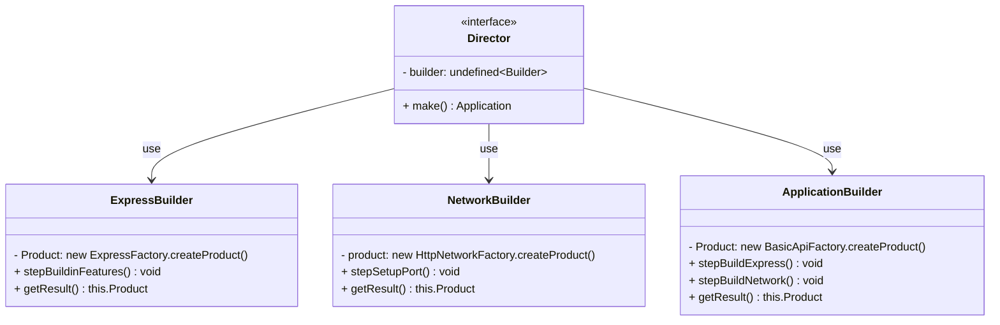

# Builder Module
Module to build express instance, this diagram describes this module.


If you see a two Creational Patterns you are in the point, in this case we take this structure, because the process to Instance a Clean Express application function (Pleace see how Express works) is better if they are isolated parts.  

---

## [Factory](./Factory/)
The Factory Pattern is a Creational Design Pattern, this structure only have the responsibility, call a new instance of one entity.

To start you require two Concepts: Product and Factory.



For this case, we are use the Factory to make some structures that we want to encapsulate e.g Express



```JavaScript
const { BasicAPIFactory } = require('./Factory');

const factory = new BasicAPIFactory();
const product = factory.createProduct();
console.log(product);
```
```Bash
ExpressApplication {  
 app: <ref *1> [Function: app] {  
   _events: [Object: null prototype] { mount: [Function: onmount] },  
   _eventsCount: 1,  
   _maxListeners: undefined,
   .
   .
   .
    },  
 features: [],  
 locals: {}  
}
```
One thing cool in this pattern, are the clean implementation, We implement approx in 3 lines of code and you receive the result.

---

## Builder

The Builder Patter are a little bit more complex than Factory, because in this patter we have more classes or intefaces.



```JavaScript
const { ApplicationDirector } = require('./Director');

const director = new ApplicationDirector(builder)

const app = director.make();

module.exports = app;
```


## [Build in Features](./features)

### [locals](./features/build_in/_locals/index.js)
This module exports a object that collect environment settings to set up variables within the application. This can be useful for sharing information across different parts of the application.

### [json](./features/build_in/_json/index.js)
This module exports a function that configures the application to use a JSON body parser. It allows the application to process incoming requests with a JSON payload. This is useful when you expect requests to your application to send data in JSON format, which is common in REST web applications.

### [raw](./features/build_in/_raw/index.js)
This module exports a function that configures the application to handle raw data sent in requests. It's useful when dealing with less common or unstructured content types.

### [Static](./features/build_in/_static/index.js)
This module exports a function that handles environment settings related to serving a static file system. Static files like images, stylesheets, and JavaScript files are served directly to the browser without further processing by the server.

### [text](./features/build_in/_text/index.js)
This module exports a function that handles environment settings related to processing requests with plain text format bodies. It's useful when you expect requests to contain data in plain text format.

### [urlencoded](./features/build_in/_urlencoded/index.js)
This module exports a function that handles environment settings related to processing requests with urlencoded body format. This is a commonly used format for sending form data from a browser to a server.


### [CORS](./features/build_in/_cors/index.js)
This module exports a function that returns a CORS (Cross-Origin Resource Sharing) middleware that handles requests and sets CORS policies. This is important when your application needs to interact with resources (like APIs) from different domains.

These modules are part of the Express ([At Version 4.x.x](https://expressjs.com/en/4x/api.html)) configuration and provide specific functionalities to tailor the application to different types of requests and environments. Each of them focuses on a particular aspect of configuration and request handling in an Express application.

---

# Home made Middle-wares

### [404](./builder/features/homebrew/middlewares/cannot_get/index.js)
This middleware captures all requests that aren't handled by the application's router. It comes into play when a requested resource cannot be found.

### [5XX](./builder/features/homebrew/middlewares/error_handler/index.js)
This middleware intercepts errors that occur within endpoint middlewares. It's responsible for handling server errors and ensuring a graceful response is sent back to the client.

### [Inspector](./builder/features/homebrew/middlewares/inspector/index.js)
This middleware intercepts all requests and injects a performance measurement object. Additionally, it generates a neatly formatted log of the incoming request, providing insights into the application's performance and behavior.

---

# OPENAPI file

this file takes the power of the node interpreter and js power of JSON structure, simply, exports a Object with estructure of [openapi spec](https://spec.openapis.org/oas/latest.html), you can copy and paste blocks of json spec and easy modifications for the syntax.


```JavaScript
module.exports = {
    openapi: '3.1.0',
    info: {
        "title": "Basic API Reference",
        "summary": "A API specification.",
        "description": "This is a sample server.",
        "termsOfService": "https://example.com/terms/",
        "version": "0.1.31",
        "contact": {
            "name": "API Support",
            "url": "https://www.example.com/support",
            "email": "support@example.com"
        },
        "license": {
            "name": "MIT",
            "url": "https://opensource.org/license/mit"
        }
    }, ... 
}
```