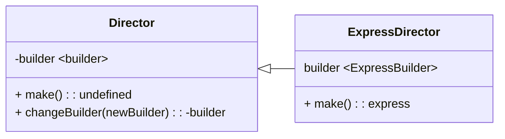

# Build Function
Este modulo exporta una función que construye una instancia de express, hacemos uso del patron de diseño Builder, para estructurar la arquitectura del modulo.


Lo bueno de este patron es que robustece el proceso de construcción de una unidad de software, separando las responsabilidades de los procesos de construcción.

ya que para este caso concreto solo se requiere de un director, obviamos el instanciamiento de un director abstracto, que se construya con un builder especifico, directamente ya instanciamos a ese director, y ejecutamos la lógica de construcción.


---

## Función Make

La funcion make del [ExpressDirector](./Director/Express/index.js) tiene la responsabilidad de ejecutar paso a paso los metodos de construccion del [ExpressBuilder](./builders/Express/index.js), segun el tipo de construccion que se quiera de express.

## Builder

El constructor de express contiene la logica de construccion de express asi como la implementacion de las caracteristicas que seran inyectadas a express, haciendo uso de una entidad que controla a express de forma global.

## [Build in Features](./features)

### [locals](./features/build_in/_locals/index.js)
This module exports a object that collect environment settings to set up variables within the application. This can be useful for sharing information across different parts of the application.

### [json](./features/build_in/_json/index.js)
This module exports a function that configures the application to use a JSON body parser. It allows the application to process incoming requests with a JSON payload. This is useful when you expect requests to your application to send data in JSON format, which is common in REST web applications.

### [raw](./features/build_in/_raw/index.js)
This module exports a function that configures the application to handle raw data sent in requests. It's useful when dealing with less common or unstructured content types.

### [Static](./features/build_in/_static/index.js)
This module exports a function that handles environment settings related to serving a static file system. Static files like images, stylesheets, and JavaScript files are served directly to the browser without further processing by the server.

### [text](./features/build_in/_text/index.js)
This module exports a function that handles environment settings related to processing requests with plain text format bodies. It's useful when you expect requests to contain data in plain text format.

### [urlencoded](./features/build_in/_urlencoded/index.js)
This module exports a function that handles environment settings related to processing requests with urlencoded body format. This is a commonly used format for sending form data from a browser to a server.


### [CORS](./features/build_in/_cors/index.js)
This module exports a function that returns a CORS (Cross-Origin Resource Sharing) middleware that handles requests and sets CORS policies. This is important when your application needs to interact with resources (like APIs) from different domains.

These modules are part of the Express ([At Version 4.x.x](https://expressjs.com/en/4x/api.html)) configuration and provide specific functionalities to tailor the application to different types of requests and environments. Each of them focuses on a particular aspect of configuration and request handling in an Express application.

---

# Home made Middle-wares

### [404](./builder/features/homebrew/middlewares/cannot_get/index.js)
This middleware captures all requests that aren't handled by the application's router. It comes into play when a requested resource cannot be found.

### [5XX](./builder/features/homebrew/middlewares/error_handler/index.js)
This middleware intercepts errors that occur within endpoint middlewares. It's responsible for handling server errors and ensuring a graceful response is sent back to the client.

### [Inspector](./builder/features/homebrew/middlewares/inspector/index.js)
This middleware intercepts all requests and injects a performance measurement object. Additionally, it generates a neatly formatted log of the incoming request, providing insights into the application's performance and behavior.

---

# OPENAPI file

this file takes the power of the node interpreter and js power of JSON structure, simply, exports a Object with estructure of [openapi spec](https://spec.openapis.org/oas/latest.html), you can copy and paste blocks of json spec and easy modifications for the syntax.


```JavaScript
module.exports = {
    openapi: '3.1.0',
    info: {
        "title": "Basic API Reference",
        "summary": "A API specification.",
        "description": "This is a sample server.",
        "termsOfService": "https://example.com/terms/",
        "version": "0.1.31",
        "contact": {
            "name": "API Support",
            "url": "https://www.example.com/support",
            "email": "support@example.com"
        },
        "license": {
            "name": "MIT",
            "url": "https://opensource.org/license/mit"
        }
    }, ... 
}
```